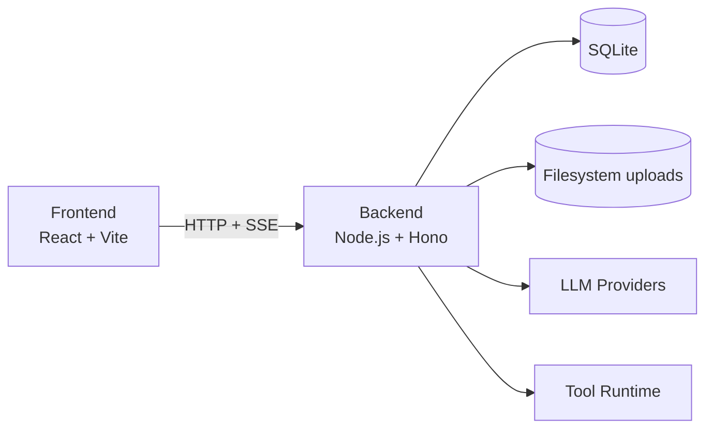

# Runvane

Self-hosted AI client for daily needs. Local-first chat app with provider-agnostic model config, agentic tool flows, and explicit tool permissions.

[](#architecture)
[](#architecture)
[](#database)
[](#deployment)

## Why Runvane

- Keep your data and runtime under your control
- Connect any LLM provider through configurable settings
- Build agentic workflows with pluggable tools
- Gate tool execution with explicit permission policies
- Stream chat updates in real time with SSE

## Quick Start

```bash
git clone <your-repo-url>
cd runvane
docker compose up --build
```

Open:

- Frontend: `http://localhost:5173`
- Backend API: `http://localhost:8001`

## Features

| Capability                     | Status |
| ------------------------------ | ------ |
| Self-hostable                  | Yes    |
| Provider-agnostic LLM setup    | Yes    |
| Agentic chat flows             | Yes    |
| Extensible tool system         | Yes    |
| Tool-level permission policies | Yes    |

## Architecture

- **Backend:** Node.js + Hono
- **Frontend:** React + Vite
- Backend exposes APIs for chat interactions, settings, uploads, and tool execution
- Frontend uses HTTP for standard operations and SSE for real-time chat updates



## Permission Model (Example)

```json
{
  "tool_name": "curl",
  "enabled": true,
  "rules": {
    "allowed": "ask"
  }
}
```

`allowed` supports:

- `always`: run automatically
- `ask`: require user approval
- `never`: block execution

## Deployment

- Docker Compose
- Suitable for local and single-host deployments

## Database

- SQLite stores messages and settings
- Uploaded files are stored on the filesystem

## Roadmap

- [ ] Additional built-in tools
- [ ] Agents reviewing other agnets for security
- [ ] More independent agentic mode
