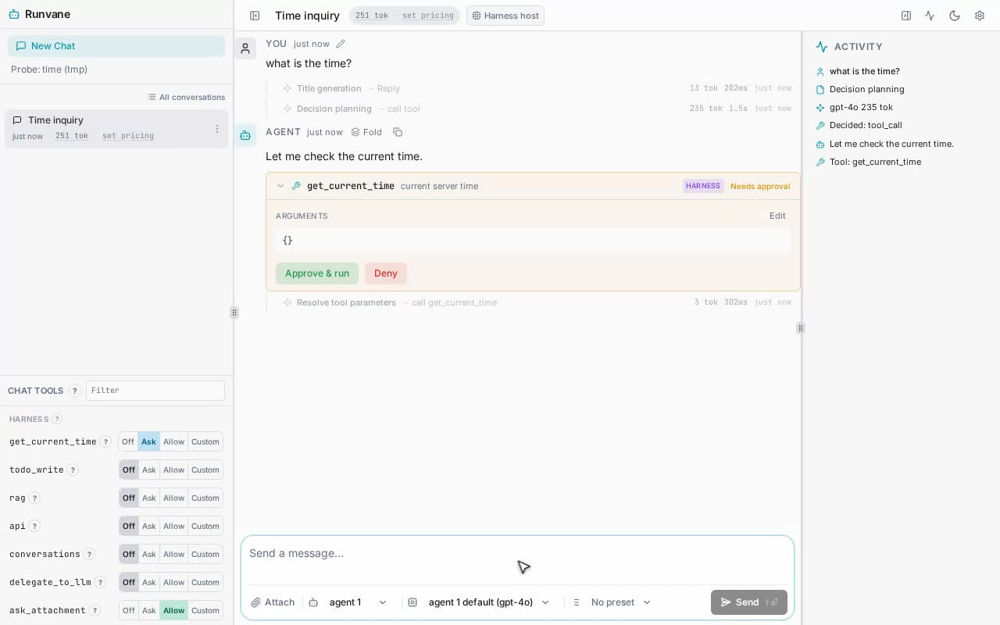
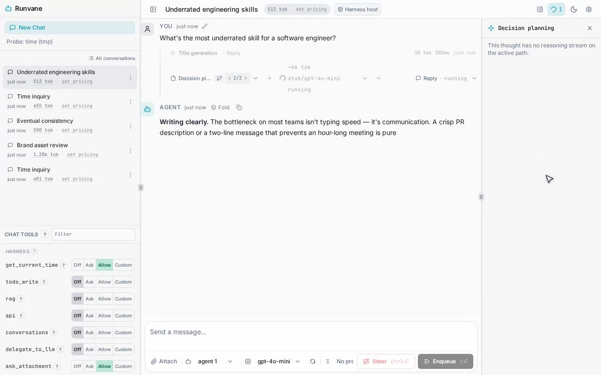
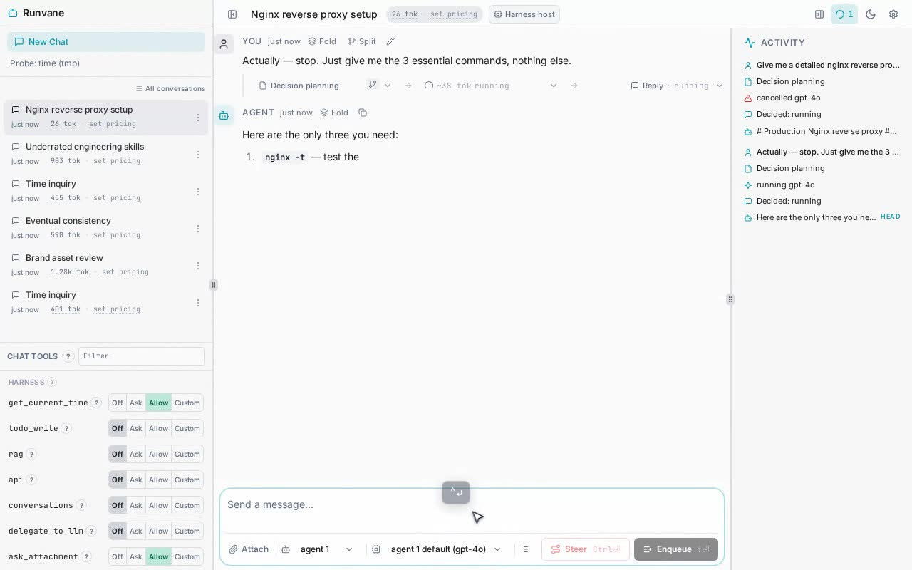
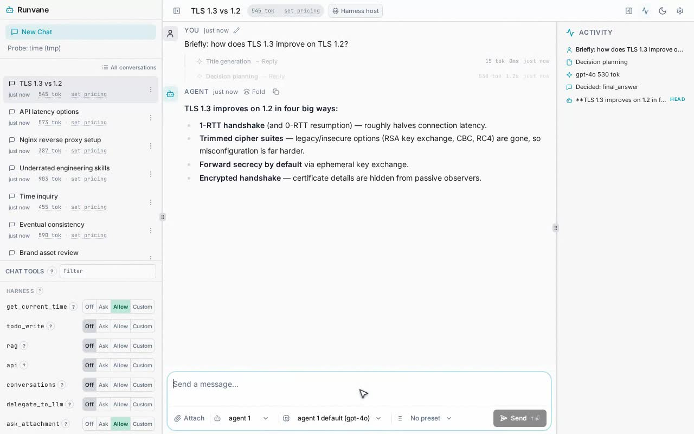
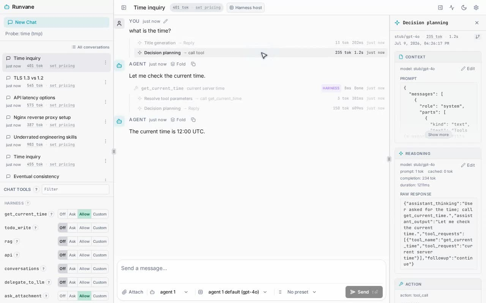
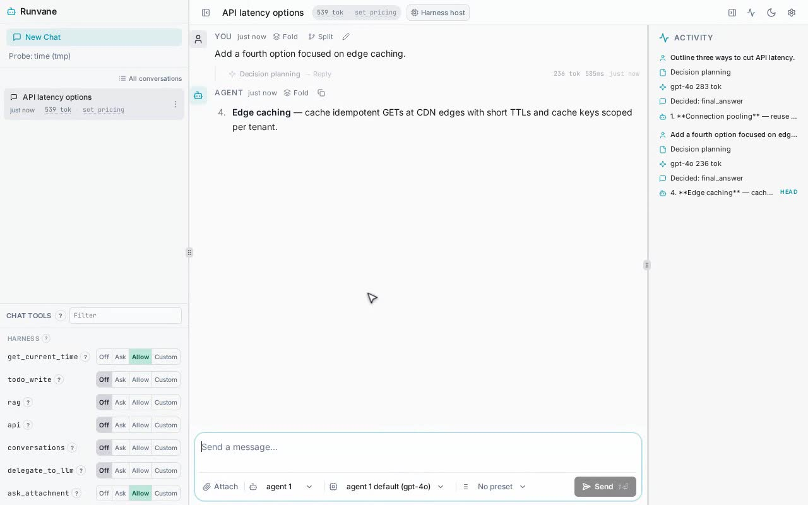
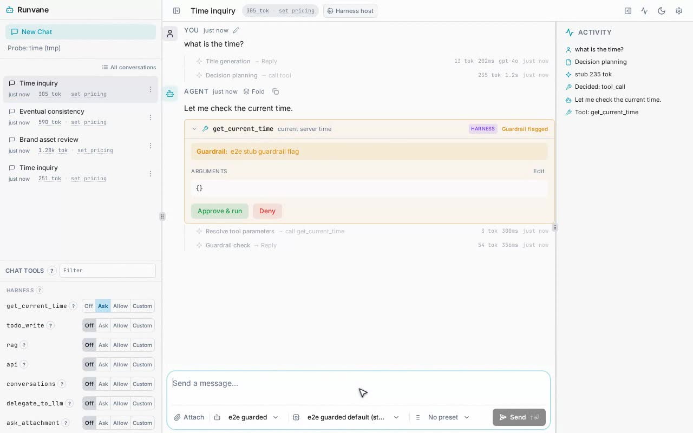
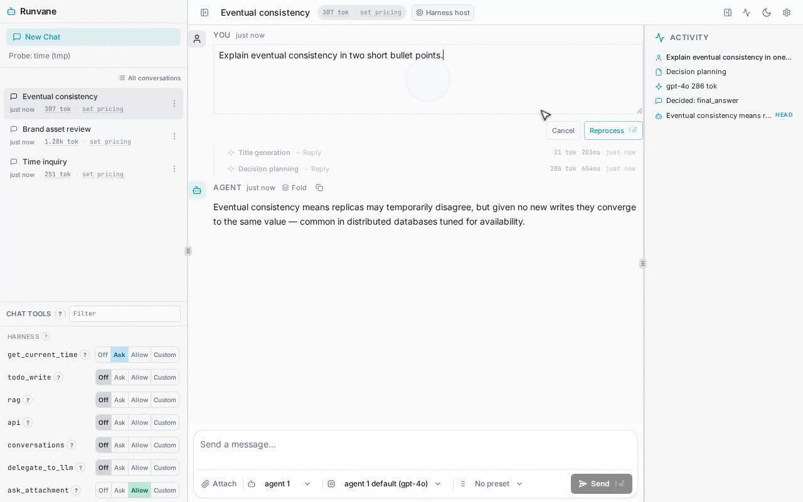
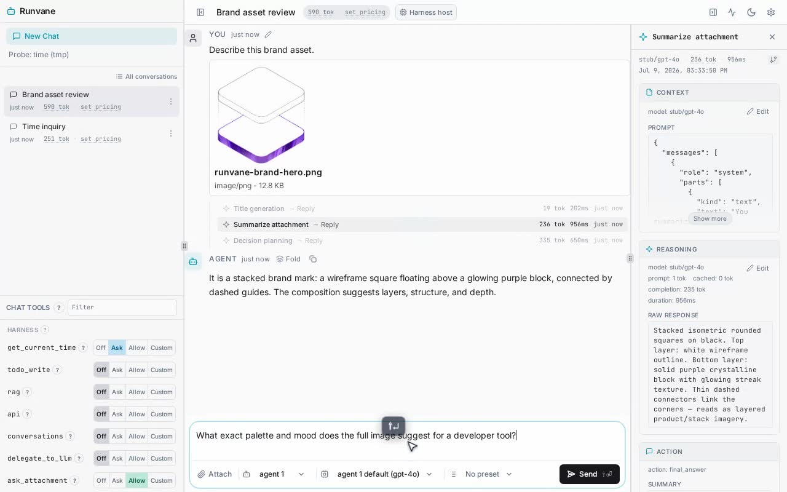

# Runvane

Long live context engineering!

Personal AI chat client focused on local-first control, flexible orchestration, and transparent runtime behavior.

## Why

- keep as much data local as possible
- avoid vendor lock-in
- customize tools, permissions, and execution flow
- get all the flexibility you want in context engineering

## Stack

[](#)
[](#)
[](#)
[](LICENSE)

## Current Features

- agentic loop with tool calls and follow-up control
- SSE-driven live UI updates
- full chat history
- token and cost visibility
- configurable model/tool behavior
- message steering (abort in-flight runs and redirect)
- RAG tool (`rag`) — semantic retrieval over configured storages, with an optional
  knowledge-graph layer (pluggable graph builders; `graph` strategy walks entity
  relations to pull in connected-but-lexically-far chunks); storages can watch
  their sources and re-index on change, with live progress in the running-tasks
  panel. Builder: `llm` (zero-dep, any configured provider) with
  [LightRAG](https://github.com/HKUDS/LightRAG)-style multi-pass gleaning and
  incremental entity-description merging built in
- api tool (backend introspection: tools, agents, presets, tasks)
- conversations tool (read chat history and conversation metadata)
- filesystem tools (`filesystem`, `filesystem_index`)
- web tools (`web_search`, `web_browse`) — search the web and read pages as markdown via a self-hosted SearXNG + Steel backend (see [`ai-browsing-enabler/`](ai-browsing-enabler/)), with browser egress routed through an SSH exit node
- import chat history from OpenAI, Gemini, Claude, and Grok (`POST /api/import/auto` auto-detects format)
- attachment summary mode with `ask_attachment` subagent for follow-up questions on full file content

## Demos

**▶ [Watch the demos](https://0xorial.github.io/runvane/)**

| | |
| --- | --- |
| [](https://0xorial.github.io/runvane/#agentic-tool-call)<br>**Agentic tool call** | [](https://0xorial.github.io/runvane/#multi-model-compare)<br>**Multi-model compare** |
| [](https://0xorial.github.io/runvane/#steering)<br>**Steering in-flight runs** | [](https://0xorial.github.io/runvane/#transparent-runtime)<br>**Transparent runtime (activity)** |
| [](https://0xorial.github.io/runvane/#transparent-thought-steps)<br>**Thought step drill-down** | [](https://0xorial.github.io/runvane/#summarize-fold)<br>**Fold + checkpoint summary** |
| [](https://0xorial.github.io/runvane/#guardrail-approval)<br>**Guardrail approval** | [](https://0xorial.github.io/runvane/#branch-reprocess)<br>**Branch on edit / reprocess** |
| [](https://0xorial.github.io/runvane/#attachment-summary)<br>**Attachment summary + subagent** | |

Re-record with `npm run demos` (needs `ffmpeg`); `npm run demos:encode` re-encodes existing recordings without re-running them. Clips land in [`docs/demo/`](docs/demo/), and GitHub Pages serves [`docs/`](docs/) straight from `main`.

## Planned features

- multi-model compare at scale (reason step already supports branch-with-different-model)
- token/time/price quotes for chats/messages
- import UI and bulk migration helpers; LLM-assisted import for arbitrary exports
- terminal connectors — single connector tool, mirror terminal in the UI (local, SSH, serial/UTM)

## Shared Definitions

- [`definitions.md`](definitions.md): canonical glossary for naming across code, docs, and agent prompts.

## Development/usage

Requires Node.js 20+. From the repo root:

```bash
npm run setup   # installs deps, creates backend/.env, runs DB migrations
npm run dev     # starts backend + frontend together (applies migrations first)
npm run ports   # show resolved dev ports
```

Then open the frontend URL printed by `npm run dev`, go to **Settings**, and add
an LLM provider — an API key (OpenAI / OpenRouter), or point it at a local
[LM Studio](https://lmstudio.ai) server to run fully free and offline.

Dev ports are allocated per project in [`dev-ports/registry.json`](dev-ports/registry.json)
(100 ports per base); change the base there if they collide.

Tests: `npm test` runs everything (unit → integration → e2e); each layer also has its own
script (`test:unit`, `test:integration`, `test:e2e`). Every run writes a full log
(requests, SQL/transaction timings, browser errors, crash stacks) to `.e2e/logs/` —
see [docs/testing.md](docs/testing.md).

## Roadmap

- additional import formats and bulk migration helpers

## License

[MIT](LICENSE) © Timur Seitosmanov
