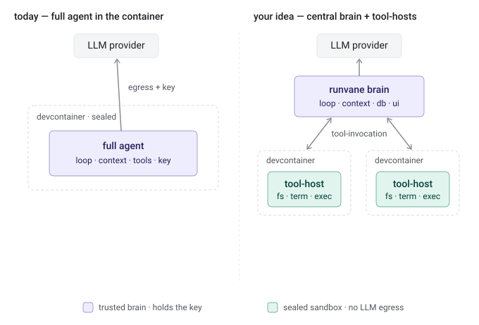

# @runvane/toolhost

A sandboxed **tool-host** for [runvane](..), a top-level package alongside
`backend/` and `frontend/`. It runs runvane's
*runtime* tools (filesystem, `exec`, …) behind a small, transport-agnostic wire
protocol, so the **brain** (the main runvane backend — agentic loop, context
engineering, conversation DB, UI) can drive them while they execute somewhere
isolated.



## Why this split

Today the whole agent runs inside the dev container. Instead, the brain stays
central (it holds the API key, talks to the LLM, owns transparency/monitoring)
and each sandbox runs only a thin tool-host the brain drives over a wire. The
sandbox needs **no LLM egress** and holds **no precious state** — it just
executes. See [`docs/protocol.md`](docs/protocol.md) for the wire contract.

## Three ways to run a host

The brain talks to a host through a `MessageChannel`. Same client code, three
transports:

| Mode | Transport | Use |
| --- | --- | --- |
| **in-process** | `linkedChannels()` | brain runs the host itself — the default "local" instance, zero serialization overhead |
| **local child** | `spawnChannel('node', ['src/host/main.ts'])` | host in its own OS process on the same machine |
| **external** | `connectSsh({ host, user })` | host on another machine/container, secured by ssh/ssl |

Start with one local in-process instance (current default). The interfaces are
shared across all three, so going per-chat or remote later is a transport swap,
not a rewrite.

**Deploying over ssh.** `connectSsh` is the bare primitive: it runs a command on
the remote (default `runvane-toolhost`) and speaks the protocol over its stdio,
so used directly the remote must already have a host. Runvane's server fills that
gap — for an ssh environment with no explicit remote command it ships this `src/`
tree to the remote (content-hashed into `~/.cache/runvane-toolhost/<hash>`) and
runs it with `node` type-stripping. The remote then needs only `node` (>=22),
`tar`, and a POSIX shell — no preinstall. First contact trusts the remote host
key (`StrictHostKeyChecking=accept-new`), so a fresh container connects without
a known_hosts entry. Set a remote command to opt out and
point at a host you installed yourself.

The server flips between them with a single config via `connectToolHost`:

```ts
import { connectToolHost } from '@runvane/toolhost';

// run it directly — the default local instance
const { client } = await connectToolHost({ mode: 'in-process' });
//  …or a local child process:     { mode: 'child' }
//  …or an external host over ssh:  { mode: 'ssh', ssh: { host, user } }

const result = await client.invoke('exec', { command: 'ls -la' }, { onProgress });
```

## Brain tools vs runtime tools

Every tool has a **location**:

- `runtime` — touches the sandbox's files/processes (`exec`, `filesystem`).
  Lives here, in the host.
- `brain` — touches central state (`rag`, `conversations`, `api`).
  Stays in the brain; never crosses the wire. RAG indexes are local to the
  brain and richly configurable, so RAG is deliberately a brain tool.

The location is surfaced to the UI (`TOOL_LOCATION_META`) so a tool row can
show with an icon/accent whether the call hit the sandbox or stayed in the
brain.

## Monitoring & cancellation

`ToolHostClient.invoke()` takes an `AbortSignal` and an `onProgress` callback —
the same shape as runvane's `ToolRunContext`. So a host tool is exposed in the
brain as a thin proxy whose `runTool` delegates over the wire; because
`run-tool.service` already wraps every `runTool` in `taskRegistry.run(...)`,
remote tool runs show up in **running-tasks monitoring** and a task-monitor
cancel aborts the signal → the client sends `cancel` → the host kills the real
process. An optional `InvocationReporter` gives a lower-level hook if you want
to feed a monitor without routing through the task registry.

## Status

Greenfield — protocol + in-process/child/ssh transports + host server with
`exec`/filesystem runtime tools + brain client. Pure Node stdlib, no runtime
deps; tests run on Node's built-in runner (`npm test`, Node ≥ 22.18).
